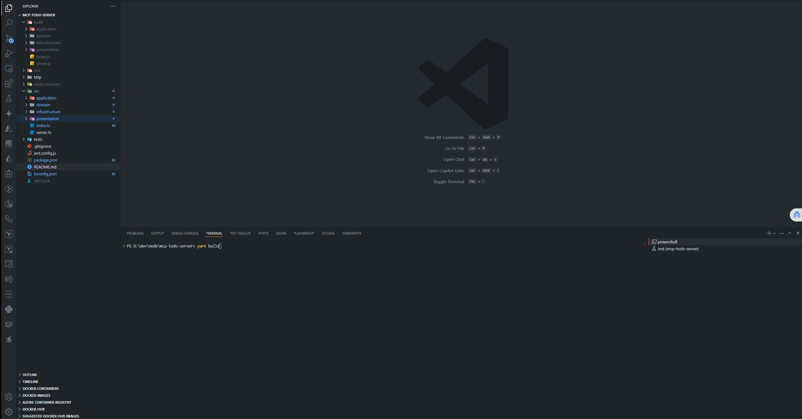
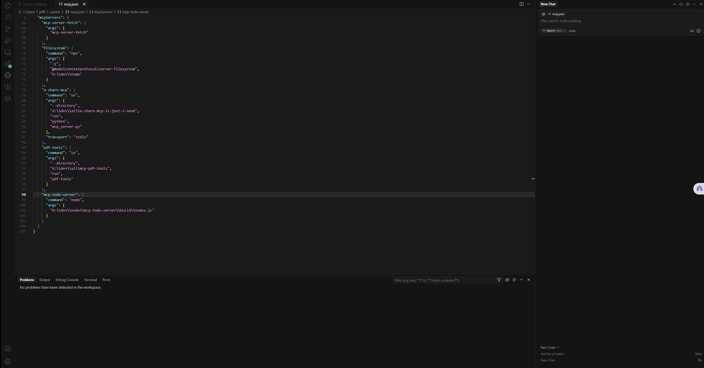
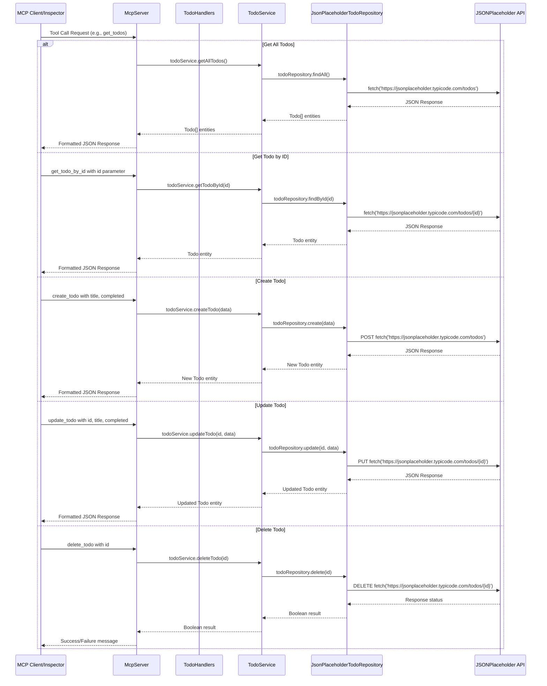

# mcp-todo-server/mcp-todo-server/README.md

# MCP Todo Server

This project is a demonstration of a clean architecture implementation using Node.js and TypeScript. It utilizes the MCPServer from the `@modelcontextprotocol/sdk` to create a server and manage todos through a JSON placeholder API.

### Demo in MCP Inspector


### Demo in Cursor


## Technology Stack

This project is built with modern technologies and follows clean architecture principles:

### Core Technologies
- **Node.js**: Runtime environment for executing JavaScript code server-side
- **TypeScript**: Strongly typed programming language that builds on JavaScript
- **Model Context Protocol (MCP)**: Protocol for AI models to interact with external tools and data sources

### Backend Framework
- **@modelcontextprotocol/sdk**: Official SDK for creating MCP-compliant servers
- **Zod**: TypeScript-first schema validation library used for input validation

### Testing
- **Jest**: JavaScript testing framework
- **Supertest**: HTTP assertions library for testing API endpoints

### Development Tools
- **tsx**: TypeScript execution environment with native ESM support
- **tsc-alias**: Tool for resolving TypeScript path aliases during compilation
- **ts-node**: TypeScript execution engine for Node.js

### Architecture
- **Clean Architecture**: The project follows a clean architecture approach with:
  - Domain layer: Core business logic and entities
  - Application layer: Use cases and application services
  - Infrastructure layer: External interactions and implementations
  - Presentation layer: API endpoints and request/response handling

### External APIs
- **JSONPlaceholder**: RESTful API for testing and prototyping providing fake todo data

## Architecture Diagram

### Sequence Diagram

The following diagram shows how requests flow through the MCP Todo Server:



## Project Structure

```
mcp-todo-server
├── src
│   ├── domain
│   │   ├── entities
│   │   │   └── todo.ts
│   │   ├── repositories
│   │   │   └── todoRepository.ts
│   │   └── valueObjects
│   │       └── todoId.ts
│   ├── application
│   │   ├── services
│   │   │   └── todoService.ts
│   │   └── useCases
│   │       ├── createTodo.ts
│   │       ├── deleteTodo.ts
│   │       ├── getTodoById.ts
│   │       ├── getTodos.ts
│   │       └── updateTodo.ts
│   ├── infrastructure
│   │   ├── repositories
│   │   │   └── jsonPlaceholderTodoRepository.ts
│   │   └── http
│   │       └── httpClient.ts
│   ├── presentation
│   │   └── handlers
│   │       └── todoHandlers.ts
│   ├── server.ts
│   └── index.ts
├── tests
│   ├── unit
│   │   ├── domain
│   │   │   └── entities
│   │   │       └── todo.test.ts
│   │   ├── application
│   │   │   └── services
│   │   │       └── todoService.test.ts
│   │   └── infrastructure
│   │       └── repositories
│   │           └── jsonPlaceholderTodoRepository.test.ts
│   └── integration
│       └── server.test.ts
├── http
│   └── todo-api.http
├── package.json
├── tsconfig.json
├── jest.config.js
└── README.md
```

## Setup Instructions

1. Clone the repository:
   ```
   git clone <repository-url>
   cd mcp-todo-server
   ```

2. Install dependencies:
   ```
   npm install
   ```

3. Run the server:
   ```
   npm start
   ```

## Usage

The server exposes various endpoints for managing todos. You can use the provided `http/todo-api.http` file to test the API endpoints manually.

## Using MCP Inspector

### What is MCP Inspector?

MCP Inspector is a tool that allows you to interact with MCP-compliant servers directly, testing tool calls and viewing responses without needing to integrate with an AI model.

### Installation

To install MCP Inspector globally:

```bash
npm install -g @modelcontextprotocol/inspector
```

### Connecting to MCP todo Server
```bash
# 1. First, build and start MCP Todo server:
npm run build
npm start

# 2. In a separate terminal, run MCP Inspector and connect it to mcp todo server:
mcp-inspector --server "node ./build/index.js"
or 
npx @modelcontextprotocol/inspector node build/index.js

# Alternatively, if mcp todo server is already running, can pipe it to the inspector:
node ./build/index.js | mcp-inspector

# 3. Once connected, the inspector will open in your default web browser, allowing you to:

# Browse available tools
# Execute tool calls with custom parameters
# View responses in a formatted JSON view
# Debug request/response cycles
```

## Setup MCP Todo Server in Cursor

1. Configure MCP integration:

2. Open Cursor settings
3. Navigate to the Extensions or AI Tools section
4. Find "Model Context Protocol" or "MCP Tools" settings
mcp.json
```code
{
  "mcpServers": {
   ... other mcp server,

    "todo-mcp-server": {
      "command": "node",
      "args": [
        "D:\\dev\\node\\mcp-todo-server\\build\\index.js"
      ]
    }
  }
}
```

## Testing

To run the unit and integration tests, use the following command:
```
npm test
```

## License

This project is licensed under the MIT License.